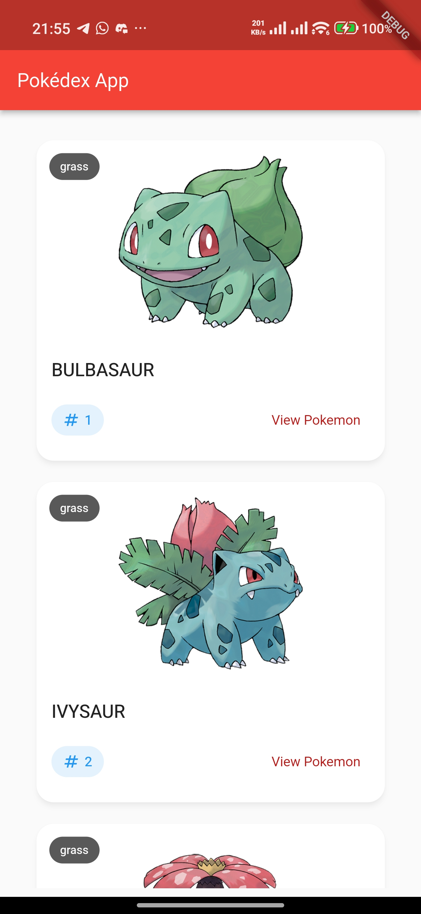
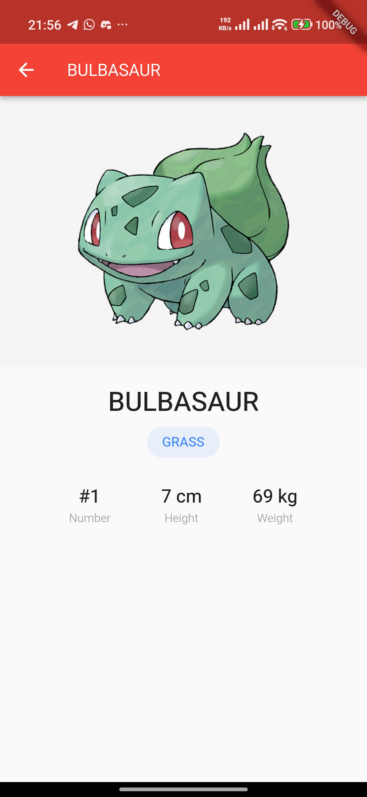

# orange_flutter_pokedex

Just a pokedex app using Flutter for learning purpose.

## Screenshots

  
  &nbsp;&nbsp;&nbsp;&nbsp;
  

## Video Demonstration

[Click here to watch the video demonstration](screenshots/demo_video.mp4)
